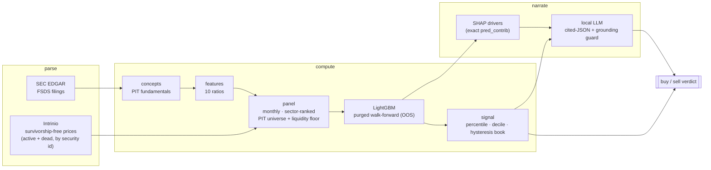
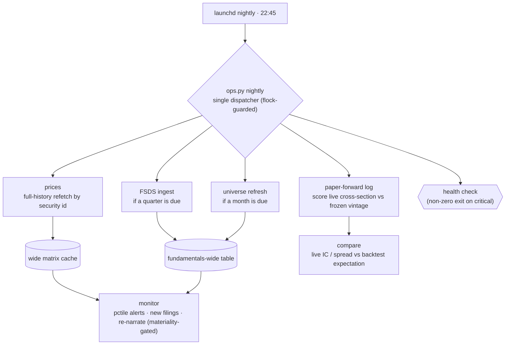

<p align="center">
  
</p>

<h1 align="center">Argus</h1>

<p align="center"><em>survivorship-free · point-in-time · honest by construction</em></p>

**Argus** is a survivorship-free, point-in-time **quantitative equity scanner** for US
stocks: parse SEC EDGAR filings → compute fundamental signals + a walk-forward ML
prediction → emit a backtested, cost-aware **buy/sell** verdict → narrate it with a local
LLM. It runs unattended and answers, per stock, *what the signal is and why*.

The name is the hundred-eyed giant of myth — an all-seeing watcher over the market. A
local **browser UI** (`scripts/argus_web.py`) is a read-mostly front-end over the same
scanner: a ranked scan, a per-ticker drill-in, a personal **book** (your holdings +
watchlist, scored), a themes/industries map, and the paper-forward honesty gate.

**Guiding rule:** every deterministic, auditable number comes from code; the LLM only
writes prose over numbers that already exist. It invents nothing and never sets the verdict.

## How it works

The scan pipeline is three stages — **parse → compute → narrate** — with a backtestable
verdict at the end. Deterministic numbers flow left to right; the LLM only ever reads the
finished packet.



The whole thing then runs **unattended** (Phase 5): a nightly `launchd` job ingests, keeps
the caches fresh, monitors a watchlist, and appends a paper-forward record scored against a
model + thresholds frozen at a registered vintage — the un-overfittable, out-of-sample test.



Full per-phase verdicts, tables, and honest caveats are in [RESULTS.md](RESULTS.md).

## The app

A local browser UI over the same serve/ops layer — `uv run python scripts/argus_web.py`,
then open <http://127.0.0.1:8000>. Everything it shows is deterministic and firewalled: the
model call, the display-only risk flags, and your own positions never mix.

**Scan** — the ranked universe; click any name to drill in, or star ☆ it onto the
watchlist without leaving the list.


**Ticker** — one name in full: the BUY/HOLD/AVOID call + a confidence chip, the price chart
(hover for OHLCV), the exact SHAP drivers, fundamental signals, news, filings, your position,
a grounded local-LLM read, an **analyst panel** — four grounded memos (bull / bear / risk /
synthesis, the bear rebuts the bull) generated by the local model over the same checked data,
cached until the data changes, always labeled commentary-not-signal — and **ask**, a grounded
chat that answers questions about the name strictly from its computed data (signals, drivers,
risk reads, recalled news). Every numeral in a reply is checked against that data; when the
answer isn't in there, it refuses rather than guesses. Dashed-underlined terms across the UI
explain themselves on hover.


**Book** — a personal scorecard: your holdings **and** watchlist scored as a same-day
peer-rank snapshot (equal- and value-weighted), with distress exposure and concentration.
A peer rank, never a portfolio forecast. *(screenshot uses demo holdings)*


**Markets** — the model's top picks by theme and fine industry, sized by live market cap.


**Paper** — the honesty gate: the frozen model's live, out-of-sample accuracy vs. what its
backtest expected.


**Watch** — the overnight digest (the grounded brief is pre-written by the nightly), the
watchlist with firewalled risk chips, alerts (with mark-all-seen), and the nightly's
12-check system-health screen.


Screenshots are regenerated with `scripts/capture_screenshots.py` (headless Chromium via
Playwright) against a throwaway instance seeded with demo data — no real portfolio is published.

## Status

All five build phases are complete and each passed its go/no-go gate. The machinery now runs
unattended per the second diagram above.

**Verdict (Phase-1 on survivorship-free data): _conditional GO_** — a modest, real edge
(walk-forward OOS rank IC **+0.0375**, t 5.6; long-only **+1.48%/yr** net over the
equal-weight universe, survives 2× costs), at the low end of the realistic 0.02–0.05 band —
research-grade validation, not a production-alpha claim.

## Setup

```bash
uv sync --extra dev        # .venv on Python 3.12 + deps
uv sync --extra web        # add FastAPI + uvicorn for the browser UI
uv run pytest -q           # 400+ tests green (also enforced by CI on every PR)
```

Keys go in `.env` (gitignored): `STOCKSCAN_INTRINIO_KEY` and `STOCKSCAN_PRICE_PROVIDER=intrinio`
for survivorship-free prices + the universe. SEC EDGAR needs no key. The data store lives under
`data/` (also gitignored); point at it with `STOCKSCAN_DATA_DIR` if it is not the repo default.

## Use

```bash
# per-ticker analysis (parse → compute → score → narrate), point-in-time as of a date
uv run python scripts/analyze.py AAPL [--as-of 2026-07-01]

# ranked sector/market scan — deterministic table now, LLM narration lazy + cached
uv run python scripts/scan.py

# the argus web UI (needs the [web] extra) — then open http://127.0.0.1:8000
uv run python scripts/argus_web.py

# unattended operation: one nightly dispatcher (ingest → monitor → paper-forward →
# store backups); alerts are position-aware and cover paper-forward grading progress
uv run python scripts/ops.py nightly       # or: health | backup | monitor | paper | prices | fsds | universe
uv run python scripts/ops.py install-launchd   # schedule it (macOS, daily 22:45)

# which local models should this machine serve? measures RAM/VRAM, sizes each model
# from the ollama library or registry, and ranks the project's own bench verdicts
# above anything merely large. Exits 1 if a CONFIGURED model isn't installed.
uv run python scripts/ops.py models
```

## Layout

```
src/stockscan/            # the import package (name unchanged; the *project* is Argus)
  config.py               # paths + the locked decisions (DESIGN.md §10)
  pit.py                  # point-in-time guard (assert_pit) — the #1 correctness invariant
  edgar/                  # SEC EDGAR: throttled client, FSDS fundamentals, delistings, tickers
  intrinio_universe.py    # survivorship-free universe (active + dead cos, keyed by security id)
  prices.py  panel.py     # per-column price store + wide close/dollar-volume matrices (+ cache)
  concepts.py  features.py  fundamental_panel.py   # PIT fundamentals → ratios → monthly panel
  sector.py  model.py  validation.py               # sector ranks, LightGBM, purged walk-forward, IC/PBO
  backtest.py             # vectorized long-only backtester (costs, borrow, hysteresis)
  serve.py                # per-ticker serve path (train/serve parity by construction)
  narrate/                # cited-JSON LLM contract + grounding validator + materiality cache
  ops/                    # unattended operation: jobs, monitor, paper-forward, health, state, lock
  portfolio.py            # the book: aggregate holdings + watchlist (display-only, firewalled)
  view/                   # read-mostly data facade (ArgusData) + shared helpers (verdict, squarify)
  web/                    # the browser UI: FastAPI serve layer over the facade
static/                   # the web front-end (index.html, app.js, charts.js, styles.css)
scripts/                  # runnable entry points (analyze, scan, argus_web, ops, run_phase{1,3}, …)
tests/                    # 400+ tests — start with the PIT guard
data/  artifacts/         # gitignored: raw data, Parquet panel, model artifacts, ops state
```

The full architecture, phased build plan, and locked decisions live in `DESIGN.md` (kept
local, not tracked). Per-phase results and the trading verdict are in [RESULTS.md](RESULTS.md).
